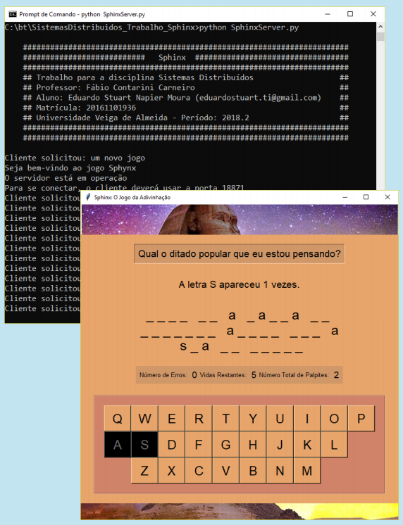

### Sphinx: O Jogo

### Sobre
Projeto final, desenvolvido por **Eduardo Stuart**, para a disciplina **Sistemas Distribuídos**, do curso de **Sistemas de Informação** da **Universidade Veiga de Almeida**.

Idealizado e desenvolvido com o ojetivo de demonstrar algumas técnicas da computação distribuída, **Sphinx** apresenta uma arquitetura cliente-servidor, em que as tarefas foram distribuídas da seguinte forma:

  * O **cliente**, ativado pelo jogador, representa a interface do jogo. O objetivo consiste em tentar adivinhar um provérbio famoso, escolhendo uma letra de cada vez.
  * O **servidor** fica encarregado de receber as requisições do cliente e respondê-las de acordo com a etapa atual, controlando toda a lógica envolvida pelo jogo.

### Destaques
* Interamente desenvolvido na linguagem **Python**, versão 3.6.
* O servidor é capaz de responder a várias requisições simultâneas de diversos clientes.
* O cliente possui uma interface gráfica moderna desenvolvida usando a biblioteca **Tkinter**
* O servidor exibe no terminal cada uma das requisições realizadas, incluindo mensagens de estado e outras informações pertinentes.
* Projeto final apresentado para a conclusão da disciplina **Sistemas Distribuídos**, ministrado pelo Mestre **Fábio Contarini Carneiro**, na **Universidade Veiga de Almeida**
* Instruções detatlhadas sobre como executar o cliente e o servidor, entre outras informações sobre o projeto, podem ser lidas no manual de operações: [Sphinx: O Jogo - Manual em PDF](https://github.com/stuarteduardo/sphinx/blob/master/Sphinx%20-%20Trabalho%20da%20disciplina%20Sistemas%20Distribu%C3%ADdos.pdf)
